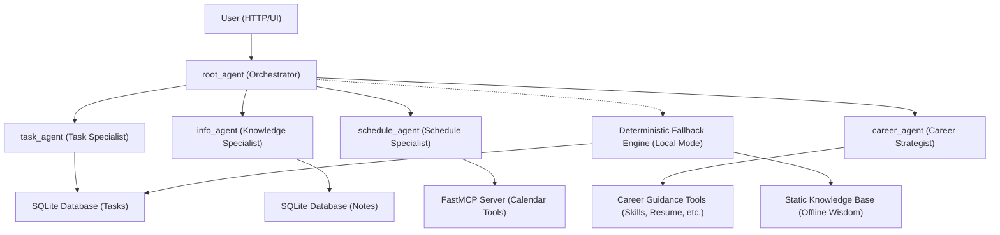

# Assistant AI 🧭
### Unified Multi-Agent Personal & Career Platform
**Gen AI Academy APAC Edition — Track 1: Build and Deploy AI Agents**

**Author:** Joseph Thomas Stalin · josephst2007@gmail.com  
**Track:** Track 1 — Build and Deploy AI Agents with ADK & Cloud Run

---

## 🦒 Overview

**Assistant AI** is a production-ready multi-agent system built with the **Google Agent Development Kit (ADK)**, **Gemini**, and **FastMCP**. It seamlessly orchestrates personal productivity (tasks/schedules) and professional growth (CareerPilot guidance) into a single, unified interface.

### Key Features
- 🤖 **Multi-Agent Orchestration** — A central `root_agent` that skillfully delegates to **Task**, **Schedule**, and **Career** specialists.
- 💾 **Persistent Storage** — SQLite-backed task tracking and note management.
- 📅 **Real-time Scheduling** — Integrated **FastMCP** server for calendar management and system tools.
- 🛡️ **Offline Resilience (Emergency Mode)** — A deterministic fallback engine and local knowledge base ensure the assistant stays active even during API outages.
- ✨ **Premium Web UI** — A stunning, dark-mode interface built with FastAPI and CSS.

---

## 🏗️ Architecture



---

## 🚀 Quick Start

### 1. Prerequisites
- Python 3.11+
- Google Cloud Project with Vertex AI enabled
- `GOOGLE_API_KEY` for Gemini access

### 2. Install
```bash
python -m venv .venv
source .venv/bin/activate
pip install -r requirements.txt
```

### 3. Run Locally
```bash
# Start the unified assistant server
python main.py
```
Open http://localhost:8080 to access the **Assistant AI Web UI**.

---

## ☁️ Cloud Run Deployment

1. **Build & Push**:
   ```bash
   gcloud builds submit --tag gcr.io/[PROJECT_ID]/assistant-ai
   ```
2. **Deploy**:
   ```bash
   gcloud run deploy assistant-ai \
     --image gcr.io/[PROJECT_ID]/assistant-ai \
     --platform managed \
     --region us-central1 \
     --allow-unauthenticated \
     --set-env-vars="GOOGLE_API_KEY=your_key_here"
   ```

---

## 📁 Project Structure

```
.
├── assistant_agent/
│   ├── agent.py               # Multi-agent orchestrator & routing
│   ├── database.py            # SQLite persistence layer
│   ├── mcp_server.py          # FastMCP server integration
│   ├── career_tools.py        # Integrated CareerPilot toolset
│   ├── deterministic_agent.py # Emergency Mode / Local fallback
│   └── static_knowledge.py    # Local wisdom repository
├── main.py                     # Unified FastAPI server & MCP runner
├── index.html                  # Premium Web UI
├── requirements.txt            # Unified dependencies
├── README.md                   # You are here
└── assistant.db                # Local database (gitignored)
```

---

## 🔒 Security & Networking (Render)

If you are using an external database or API that requires whitelisting, please add the following **Render Outbound IP Ranges**:

- **Range 1**: `74.220.52.0/24`
- **Range 2**: `74.220.60.0/24`

---

## 💡 Example Queries

| Intent | Sample Query |
|---|---|
| **Task** | "Add 'Prepare for Hackathon' to my tasks" |
| **Schedule** | "Show my calendar events for tomorrow" |
| **Career** | "Suggest skills for a Cloud Architect role" |
| **Resume** | "Provide feedback on my resume: [text]" |
| **Resilience** | (Auto-switches to Local Mode on API failure) |

---
**Status**: 🏁 **Final Submission Complete** · Published to GitHub & Ready for Review.
