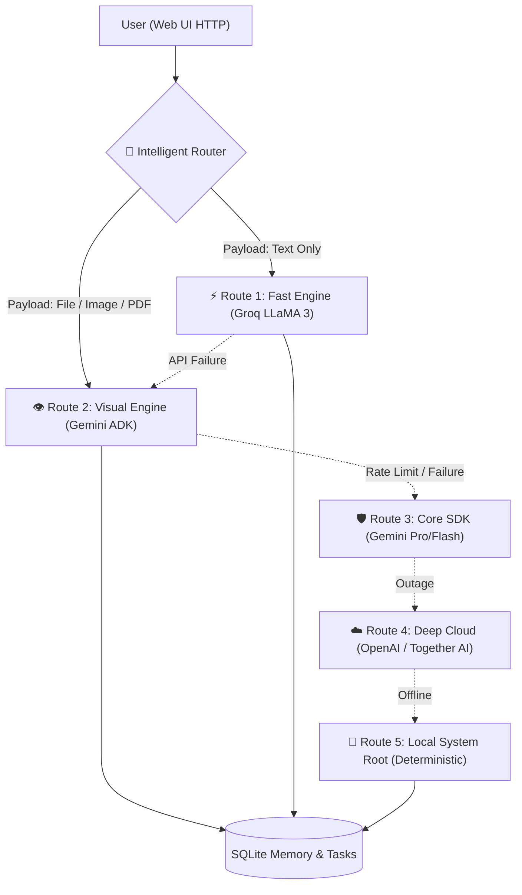

<div align="center">
  <h1>✨ Career AI</h1>
  <p><strong>Gen AI Academy APAC Edition — Track 1: Build and Deploy AI Agents</strong></p>
  <p>A production-ready, ultra-resilient multi-agent personal and career assistant powered by a custom Intelligent Dynamic Router, Google ADK, and an automated 5-Layer Fallback Architecture.</p>
</div>

---

## 🚀 Overview

**Career AI** goes beyond a simple LLM wrapper. Built on **Starlette** and the **Google Agent Development Kit (ADK)**, it introduces a highly intelligent "Dynamic Fast-Router" that automatically analyzes your payload and dispatches it to the most efficient AI model available, seamlessly falling back across 5 independent engine layers if an API fails—guaranteeing 100% uptime and a frictionless user experience.

### 🔥 Key Innovations
- 🧠 **Intelligent Dynamic Router:** Text-only queries are instantly routed to lightening-fast execution layers, while multimodal payloads (Images/PDFs) dynamically force visual-reasoning routing via Gemini ADK.
- 🛡️ **Ghost Mode (5-Layer Resilience):** Never suffer an API outage again. If the primary Orchestrator fails, the system automatically cascades through Groq, Together AI, OpenAI, and finally a local Deterministic Base.
- 🎭 **Model Masking:** All underlying deep-cloud APIs and fallback models are seamlessly masked and natively prompted to behave identically to the primary persona ("Gemini"), ensuring consistent UX.
- 💾 **Persistent Universal Memory:** SQLite-backed tracking for tasks and conversational context. *(Pinecone Vector DB structure initialized for future scale).*
- ⚡ **Starlette Architecture:** Migrated from rigid frameworks to ultra-fast Starlette ASGI to handle complex multimodal form-data parsing efficiently.

---

## 🏗️ Architecture



---

## 🛠️ Tech Stack & Failsafes

*   **Framework:** Starlette ASGI, Python 3.11+
*   **Agent Framework:** Google ADK (Agent Development Kit), FastMCP
*   **Primary Intelligence:** Gemini 2.0 Flash / 1.5 Pro
*   **Fast-Route Intelligence:** Groq (LLaMA 3.3 70B) — *Heavily optimized via max_tokens limits.*
*   **Deep Cloud Failsafes:** OpenAI, Together AI
*   **Web Search Context:** Tavily Search API
*   **Database:** Local SQLite (Pinecone stubbed)

---

## 🚀 Quick Start

### 1. Prerequisites
- Python 3.11+
- API Keys: `GOOGLE_API_KEY`, `GROQ_API_KEY` *(Optional: `TOGETHER_API_KEY`, `OPENAI_API_KEY`, `PINECONE_API_KEY`)*

### 2. Install & Run Locally
```bash
python -m venv .venv
source .venv/bin/activate
pip install -r requirements.txt

# Start the unified assistant server
python main.py
```
Open `http://localhost:10000` to access the Assistant UI.

---

## ☁️ Cloud Deployment (Render / Cloud Run)

This project is fully optimized for containerized cloud deployment. A generic `Dockerfile` is provided.

For **Render.com**:
1. Connect this GitHub repository to Render Web Services.
2. Select Docker as the Runtime.
3. Expose the environment variables under the deployment settings.
4. Auto-Deploy will listen on `PORT 10000`.

*(A GitHub Action `.github/workflows/keep_alive.yml` is included to automatically ping the server and prevent Render free-tier deep-hibernation).*

---
<div align="center">
  <i>Built with ❤️ for Gen AI Academy APAC Edition — Track 1</i>
</div>
